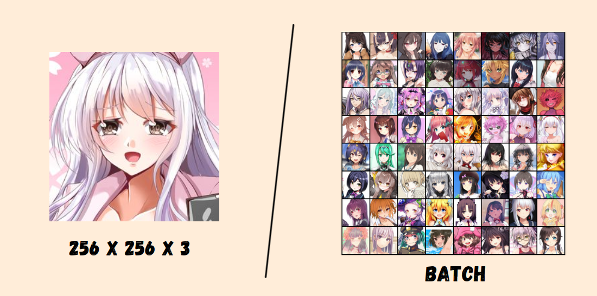
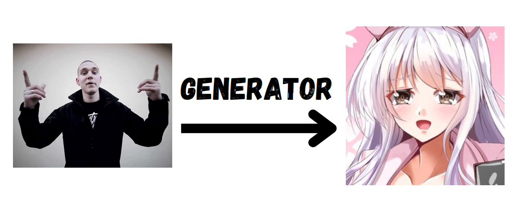
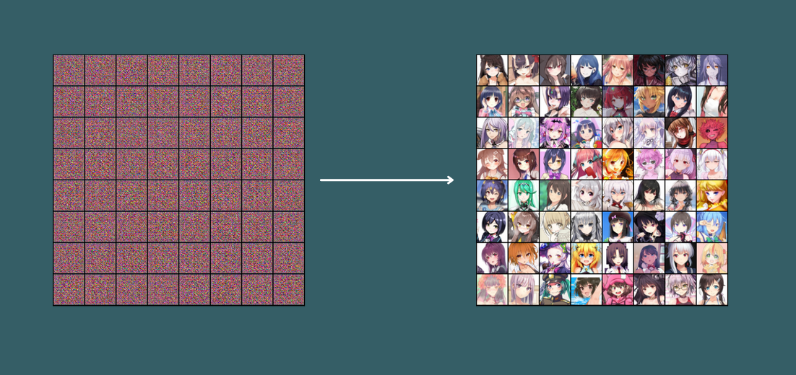
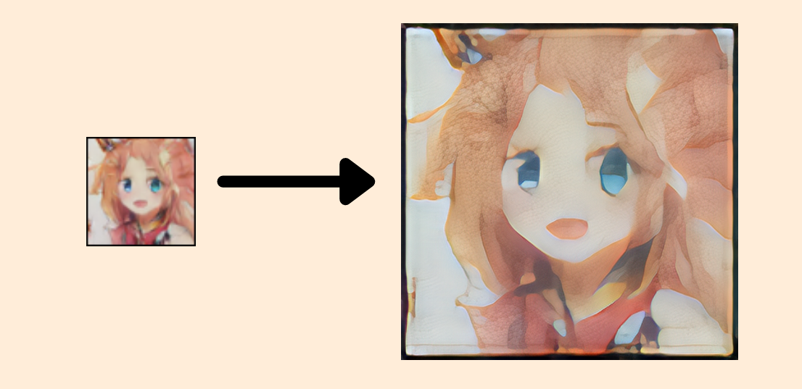
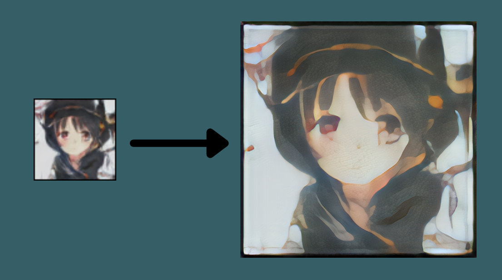
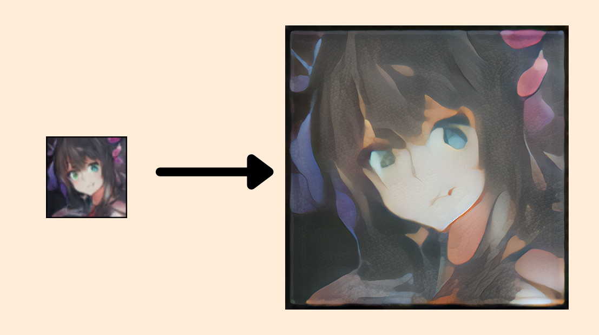

<h1 align="center">OIL ART GAN</h1>

<h2 align="center">Dataset</h2>

  <i>Dataset - <a href="https://www.kaggle.com/datasets/scribbless/another-anime-face-dataset">here</a></i>

<h2 align="center">Generator and discriminator</h2>

- Generator architecture:

___Random input with a shape [128, 1, 1] ->___

___-> 4 blocks of [ConvTranspose2d -> BatchNorm2d -> ReLU activation] ->___

___-> Conv2d -> Tanh activation -> Generated images with a shape [3, 64, 64]___

- Discriminator architecture:

___Images with a shape [3, 64, 64] ->___

___-> 4 blocks of [Conv2d -> BatchNorm2d -> LeakyReLU activation] ->___

___-> ConvTranspose2d -> Sigmoid activation -> Classification (Real data or created by generator)___

<h2 align="center">Expectations</h2>

<h2 align="center">Training</h2>

https://user-images.githubusercontent.com/98667578/165276918-0f487416-d8c5-4459-a35c-08a6c5cdf68f.mp4

https://user-images.githubusercontent.com/98667578/165276761-159b0253-bc42-4d25-a49c-1008483b3151.mp4

<h2 align="center">Transform to oil art with ISR</h2>

